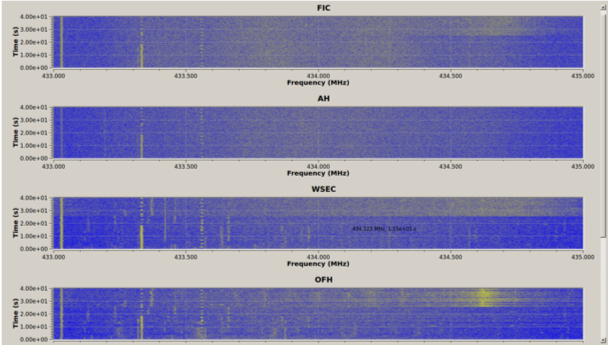
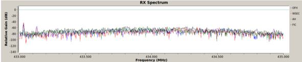

# Getting Started on NEXTT

1. [Setup HCC accounts](#account)
2. [Create a Virtual Machine instance on Anvil](#anvil)
3. [Install GNURadio and UHD on the Virtual Machine.](#install)
4. [Run exemplary GNURadio program](#example)
5. [Create and Run your own GNURadio program](#program)
6. [Run your offline processing algorithms](#process)

## Step 1: Setup HCC Accounts <a name="account" class="anchor"></a>
Please follow [instructions](https://hcc.unl.edu/new-user-request) to signup your new account. Please select ```nextt``` as group. Once this is done, apply access to HCC Anvil cloud follow this [instruction](https://hcc.unl.edu/request-anvil-access),

## Step 2: Create a Virtual Machine instance on Anvil <a name="anvil" class="anchor"></a>
Create an Virtual Machine (VM) instance, e.g. Ubuntu 16.04 LTS, on Anvil following this [link](https://hcc-docs.unl.edu/display/HCCDOC/Anvil%3A+HCC%27s+Cloud). 

## Step 3: Install GNURadio and UHD on Virtual Machine <a name="install" class="anchor"></a>
Please follow this script to install UHD and GNURadio on Ubuntu 16.04 VM

```
sudo apt-get -y install git swig cmake doxygen build-essential libboost-all-dev libtool libusb-1.0-0 libusb-1.0-0-dev libudev-dev libncurses5-dev libfftw3-bin libfftw3-dev libfftw3-doc libcppunit-1.13-0v5 libcppunit-dev libcppunit-doc ncurses-bin cpufrequtils python-numpy python-numpy-doc python-numpy-dbg python-scipy python-docutils qt4-bin-dbg qt4-default qt4-doc libqt4-dev libqt4-dev-bin python-qt4 python-qt4-dbg python-qt4-dev python-qt4-doc python-qt4-doc libqwt6abi1 libfftw3-bin libfftw3-dev libfftw3-doc ncurses-bin libncurses5 libncurses5-dev libncurses5-dbg libfontconfig1-dev libxrender-dev libpulse-dev swig g++ automake autoconf libtool python-dev libfftw3-dev libcppunit-dev libboost-all-dev libusb-dev libusb-1.0-0-dev fort77 libsdl1.2-dev python-wxgtk3.0 git-core libqt4-dev python-numpy ccache python-opengl libgsl-dev python-cheetah python-mako python-lxml doxygen qt4-default qt4-dev-tools libusb-1.0-0-dev libqwt5-qt4-dev libqwtplot3d-qt4-dev pyqt4-dev-tools python-qwt5-qt4 cmake git-core wget libxi-dev gtk2-engines-pixbuf r-base-dev python-tk liborc-0.4-0 liborc-0.4-dev libasound2-dev python-gtk2 libzmq-dev libzmq1 python-requests python-sphinx libcomedi-dev python-zmq
mkdir workarea-uhd
cd workarea-uhd
git clone https://github.com/EttusResearch/uhd
cd uhd
git checkout UHD-3.13
git checkout tags/v3.13.0.2
cd host
mkdir build
cd build
cmake ../
sudo make
sudo make test
sudo make install
sudo ldconfig
echo 'export LD_LIBRARY_PATH=/usr/local/lib' >> ~/.bashrc
cd ../../../../
mkdir workarea-gnuradio
cd workarea-gnuradio
git clone --recursive https://github.com/gnuradio/gnuradio
cd gnuradio
git checkout v3.7.13.4
git submodule update --init --recursive
mkdir build
cd build
cmake ../
sudo make
sudo make test
sudo make install
sudo ldconfig
gnuradio-config-info --version
gnuradio-config-info --prefix
gnuradio-config-info --enabled-components
echo 'export PYTHONPATH=/usr/local/lib/python2.7/dist-packages' >> ~/.bashrc
cd ../../../workarea-uhd/uhd/host/utils/
sudo cp uhd-usrp.rules /etc/udev/rules.d/
sudo udevadm control --reload-rules
sudo udevadm trigger

```

If the installation fails, you will need remove the previous installation with following script

```
sudo rm -rf $HOME/Softwares/GNURadio/workarea-*
sudo rm -rf /usr/local/lib/uhd/
sudo rm -rf /usr/local/lib/libuhd*
sudo rm -rf /usr/local/include/uhd*
sudo rm -rf /usr/local/share/uhd/
sudo rm -rf /usr/local/lib/cmake/uhd
sudo rm -rf /usr/local/include/gnuradio
sudo rm -rf /usr/local/include/volk
sudo rm -rf /usr/local/share/doc/gnuradio*
sudo rm -rf /usr/local/share/doc/uhd
sudo rm -rf /usr/local/lib/python2.7/dist-packages/uhd
sudo rm -rf /usr/local/lib/python2.7/dist-packages/gnuradio
sudo rm -rf /usr/local/lib/python2.7/dist-packages/grc*
sudo rm -rf /usr/local/lib/python2.7/dist-packages/volk*
sudo rm -rf /usr/local/share/gnuradio
sudo rm -rf /etc/security/limits.d/uhd.conf
sudo rm -rf /etc/udev/rules.d/uhd*
sudo rm -rf /usr/local/lib/libgnuradio*
sudo rm -rf /usr/local/lib/libvolk*
sudo rm -rf /usr/local/lib/libairspy*
sudo rm -rf /etc/apt/trusted.gpg.d/*uhd*
sudo rm -rf /etc/apt/sources.list.d/*uhd*
sudo rm -rf /usr/local/lib/pkgconfig/uhd*
sudo rm -rf /usr/local/lib/pkgconfig/volk*
sudo rm -rf /usr/local/lib/pkgconfig/gnuradio*
sudo rm -rf /usr/local/lib/pkgconfig/gr*
sudo rm -rf /usr/local/share/man/man1/uhd*
sudo rm -rf /usr/local/share/man/man1/usrp*
sudo rm -rf /usr/local/etc/gnuradio/
sudo rm -rf /usr/local/libexec/gnuradio/
sudo rm -rf /usr/local/lib/cmake/gnuradio/
sudo rm -rf /usr/local/lib/cmake/volk/
sudo rm -rf /usr/share/mime/packages/gnuradio*
sudo rm -rf /usr/share/mime/application/gnuradio*

```

## Step 4: Run exemplary GNURadio program  <a name="example" class="anchor"></a>
In your reserved time on NEXTT, start GNURadio in your Ubuntu VM
```
sudo gnuradio-companion
```
and run the exemplary spectrum sensing code [Distributed_Monitor.grc](./Distributed_Monitor.grc)

The program monitors 433-435MHz as shown here



## Step 5: Create and Run your own GNURadio program <a name="program" class="anchor"></a>
You can create your own GNURadio program to collect IQ data from distributed sites, run your program and save data files to your VM. 

## Step 6: Run your offline processing algorithms  <a name="process" class="anchor"></a>
If you decided to run offline processing, e.g. distributed spectrum sensing, you can do the following. Once you collected the data files from the GNURadio program, you could download them to your work directory on HCC clusters, such as [Crane](crane.unl.edu) and [Tuskers](tuskers.unl.edu), to process them offline. Please refer to the [HCC documentation](https://hcc-docs.unl.edu/display/HCCDOC/HCC+Documentation) for how to access and use HCC clusters. You can also download your data to your local computers. Note that the data files stored on the HCC clusters will only be kept for 6 months.
